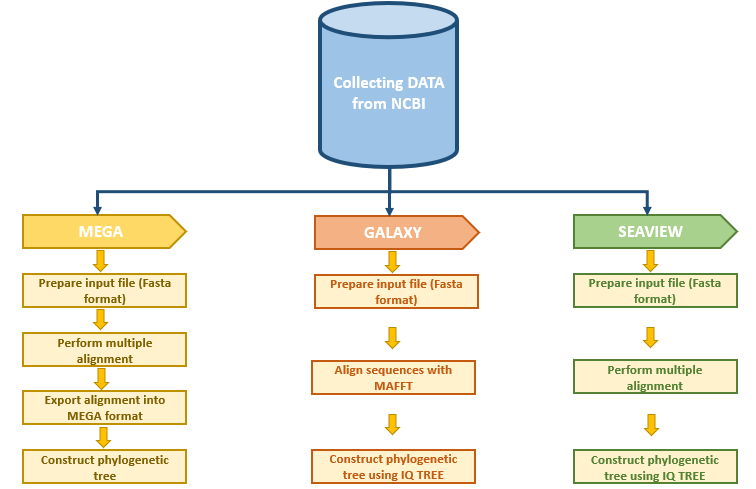

# Comparative Study between Molecular and Genetic Evolutionary Analysis Tools Using African SARS-CoV-2 Variants
#### Our Team. Lead: Nouhaila En najih, Awe Olaitan- Writers: Latifah Benta Mukanga

## **Abstract**
Phylogenetic analysis is considered to be a highly reliable and important bioinformatics tool.Currently we have many phylogenetic tools that biologists can use to interpret and visualize biological data.However,most of these tools require a lot of expertise and technical know-how for one to be able to use them.In this study,African SARS-CoV-2 Variants are used to compare three phylogenetic tools(MEGA, Seaview and Galaxy) in terms of their ease of use,output and accessibility.

## **Aim of the study**

## **Methods
### **Data Collection

### **Data Preprocessing

## **Workflow**

