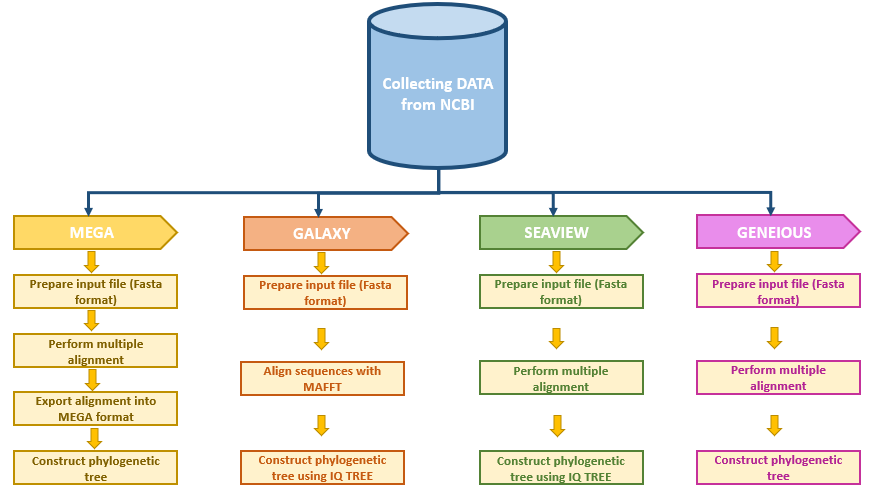
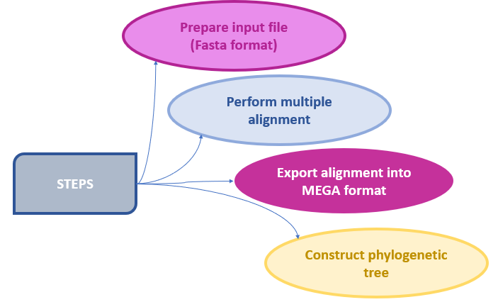

# Comparative Study between Molecular and Genetic Evolutionary Analysis Tools Using African SARS-CoV-2 Variants
#### Our Team. Lead: Nouhaila En najih, Awe Olaitan- Writers: Latifah Benta Mukanga

## Abstract
Phylogenetic analysis is considered to be a highly reliable and important bioinformatics tool.Currently we have many phylogenetic tools that biologists can use to interpret and visualize biological data.However,most of these tools require a lot of expertise and technical know-how for one to be able to use them.In this study,African SARS-CoV-2 Variants are used to compare three phylogenetic tools(MEGA, Seaview, Galaxy and Geneious) in terms of their ease of use,output and accessibility.

## Methods
### Data Collection

The SARS CoV 2 complete genome  sequences from different countries in the South African region were retrieved from the NCBI Virus repository (www.ncbi.nlm.nih.gov, n.d.) in fasta format.

### Data Preprocessing

## Phylogenetic Analysis with MEGA

## Phylogenetic Analysis with GALAXY

